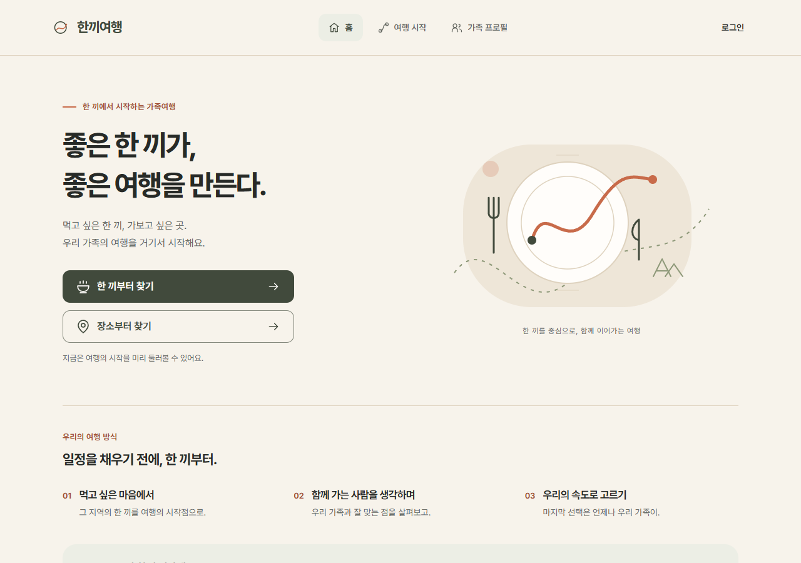
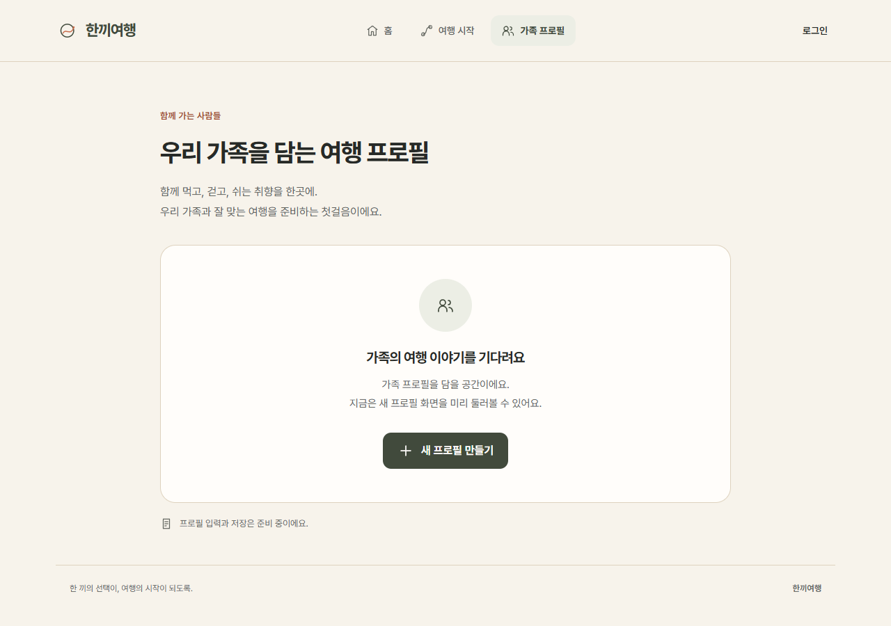
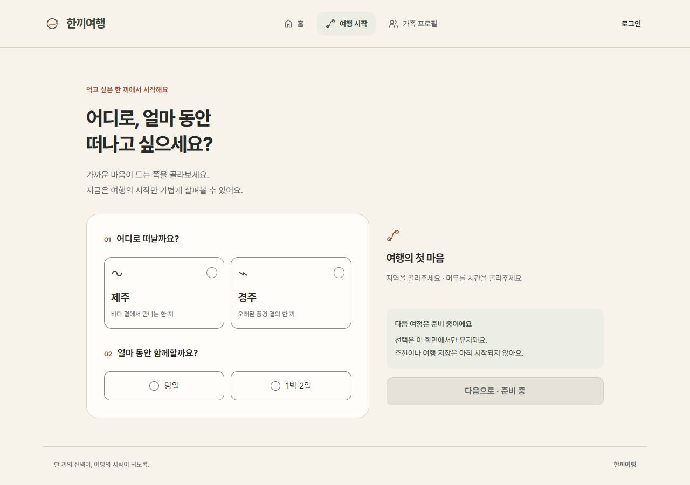
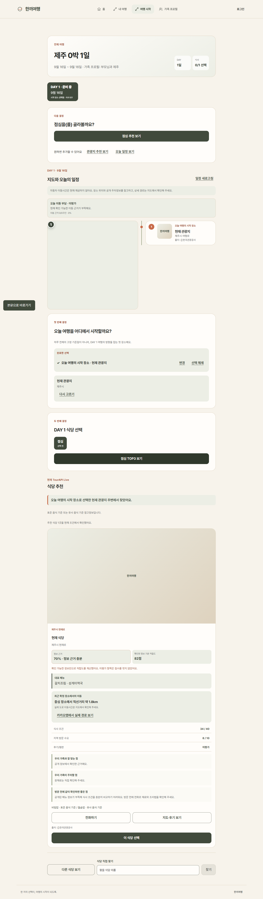
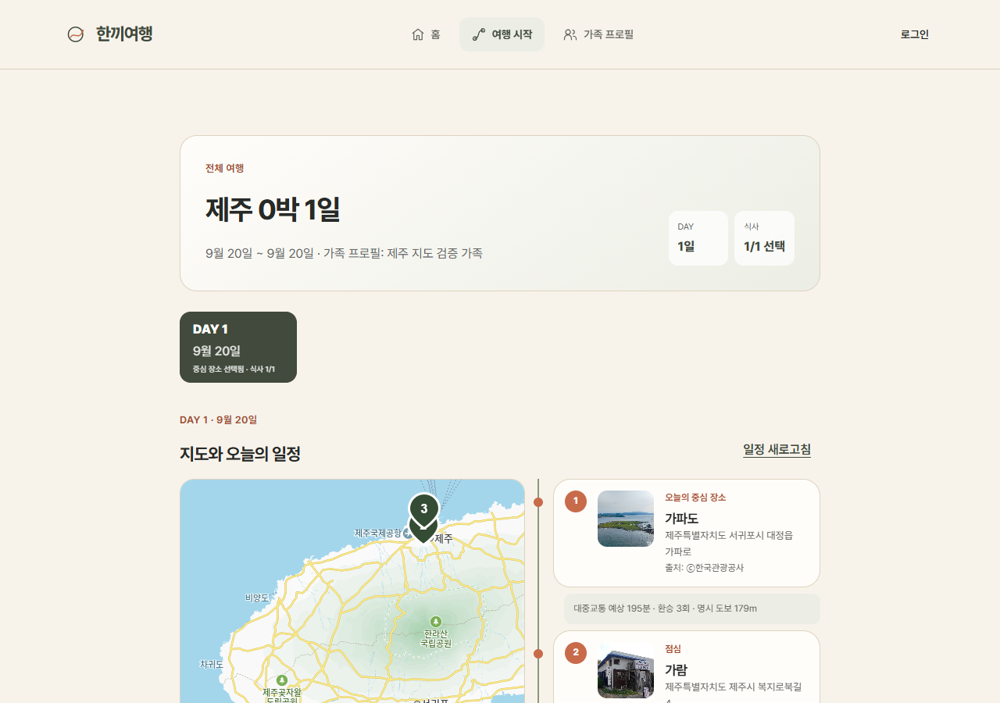
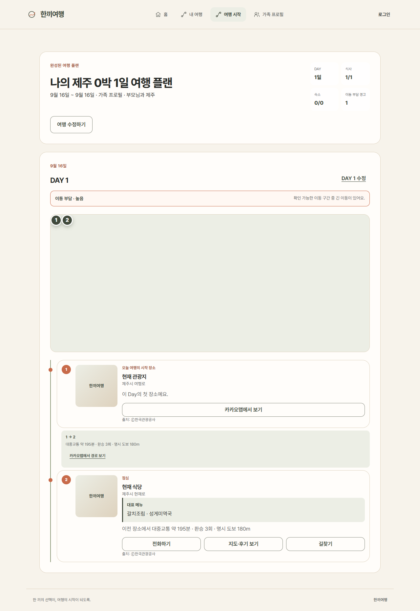

# 한끼여행 (HankkiTravel)

> 관광데이터를 바탕으로 가족의 식사 조건과 이동 부담을 함께 고려하는 여행·식당 플래너

[서비스 데모](https://hankki.kro.kr/) · [아키텍처](docs/architecture/README.md) · [API](docs/api/README.md) · [운영 구조](docs/infra/README.md)

## 문제 정의

가족 여행에서 식사는 단순한 "맛집 검색" 문제가 아닙니다. 연령대, 알레르기·식단 조건, 동행 인원, 식사 시간, 이동 거리, 관광 일정이 동시에 맞아야 합니다. 한끼여행은 이 조건들을 여행 프로필과 일정으로 연결해, 가족이 실제로 선택 가능한 식당과 관광 동선을 제안합니다.

## 대표 화면

실제 공개 서비스의 메인 화면입니다. 한 끼를 출발점으로 가족 여행을 설계한다는 서비스 방향과 두 가지 시작 경로를 한눈에 보여줍니다.



## 핵심 기능

- 관광공사 TourAPI 기반으로 제주·서귀포·경주의 관광지·숙박·음식점 데이터를 동기화하고, 비정상 스냅샷을 방어합니다.
- 가족 구성원별 식사 조건과 여행 선호를 반영해 식당 후보와 추천 근거를 제공합니다.
- 여행 일정 중 이동 부담을 계산해 무리한 동선을 경고하고, 단계적으로 플랜을 구성합니다.
- Kakao Map으로 일자별 방문 후보와 경로를 시각화합니다.
- 관리자 관광데이터 동기화는 기본 비활성화하고, 단일 실행·호출 예산·이상 스냅샷 방어를 둡니다.

## 페이지 안내

모든 캡처는 테스트용 여행·장소 데이터로 구성했으며, 실제 사용자 정보와 운영 비밀값은 포함하지 않습니다.

| 순서 | 페이지 | 소개 |
| --- | --- | --- |
| 1 | 메인 | 한 끼 또는 장소부터 가족 여행을 시작하는 두 진입점을 제공합니다. |
| 2 | 가족 프로필 | 함께 떠나는 사람과 식사·이동 조건을 여행 맥락에 담기 위한 진입 화면입니다. |
| 3 | 여행 시작 | 제주·경주와 여행 기간을 고르고, 여행의 첫 선택을 확인합니다. |
| 4 | 식당 추천 | 가족 조건, 현재 위치와 이동 부담을 근거로 식당 후보를 비교·선택합니다. |
| 5 | 지도 일정 | Kakao Map과 방문 순서를 함께 보며 일자별 동선을 조정합니다. |
| 6 | 완성 플랜 | 선택한 관광지·식당, 이동 부담과 경로 확인 행동을 한 화면에 정리합니다. |

<details>
<summary><strong>가족 프로필</strong> — 함께 떠나는 사람과 여행 조건을 정리하는 시작 화면</summary>

동행인의 여행 조건을 정리하는 시작 화면입니다. 현재 공개 화면은 프로필 생성 진입과 안내를 제공하며, 입력·저장 기능은 후속 고도화 대상으로 표시됩니다.


</details>

<details>
<summary><strong>여행 시작</strong> — 여행 지역과 기간을 선택하는 첫 단계</summary>

여행 지역과 기간을 먼저 골라 이후 추천과 일정 구성의 기준을 만듭니다.


</details>

<details>
<summary><strong>식당 추천 및 선택</strong> — 가족 조건과 이동 부담을 반영한 한 끼 선택</summary>

가족 조건과 이동 부담, 현재 위치를 바탕으로 후보를 비교하고 한 끼를 선택합니다.


</details>

<details>
<summary><strong>지도 기반 일정 플래너</strong> — Kakao Map으로 일자별 동선을 검토</summary>

Kakao Map 위에 방문 순서와 이동 정보를 함께 배치해 일자별 동선을 검토합니다.


</details>

<details>
<summary><strong>완성된 여행 플랜</strong> — 선택 결과와 다음 행동을 한곳에서 확인</summary>

완료한 선택을 순서대로 확인하고, 장소 상세·길찾기 등 다음 행동으로 이어집니다.


</details>

## 서비스 구조

```text
사용자 조건·여행 일정
        ↓
Vue 3 / Vite Frontend ── Kakao Map
        ↓
Spring Boot Backend
   ├── TourAPI / 관광데이터
   ├── 추천·일정·이동 부담 로직
   └── MySQL
        ↓
운영 배포: Vercel / AWS EC2
운영 자동화: GitHub Actions → GHCR → AWS
관측: Prometheus / Grafana
```

자세한 모듈 경계와 데이터 흐름은 [아키텍처 문서](docs/architecture/README.md)에 정리했습니다.

## 기술 스택

| 영역 | 구성 |
| --- | --- |
| Frontend | Vue 3, Vite, Pinia, Vue Router, Vitest, Playwright |
| Backend | Java 21, Spring Boot, Spring Security, MyBatis, Flyway |
| 데이터 | MySQL, 한국관광공사 TourAPI, 식품영양 데이터 |
| 지도·교통 | Kakao Map, Kakao Mobility/대중교통 연동 |
| 배포·운영 | Vercel, AWS EC2, GitHub Actions, GHCR, Prometheus, Grafana |

## 저장소 구성

```text
HankkiTravel/
├── frontend/             # Vue/Vite 웹 애플리케이션
├── backend/              # Spring Boot API 및 데이터 동기화
├── docs/
│   ├── architecture/     # 시스템·모듈 경계
│   ├── api/              # 공개·운영 API 개요
│   ├── infra/            # 배포·관측·보안 경계
│   └── screenshots/      # 포트폴리오용 캡처 안내
└── .env.example          # 값 없는 환경 변수 템플릿
```

이 저장소는 포트폴리오용 통합본입니다. 운영 중인 프론트·백엔드 원본 저장소와 Vercel/AWS 배포 연결은 수정하지 않았습니다.
