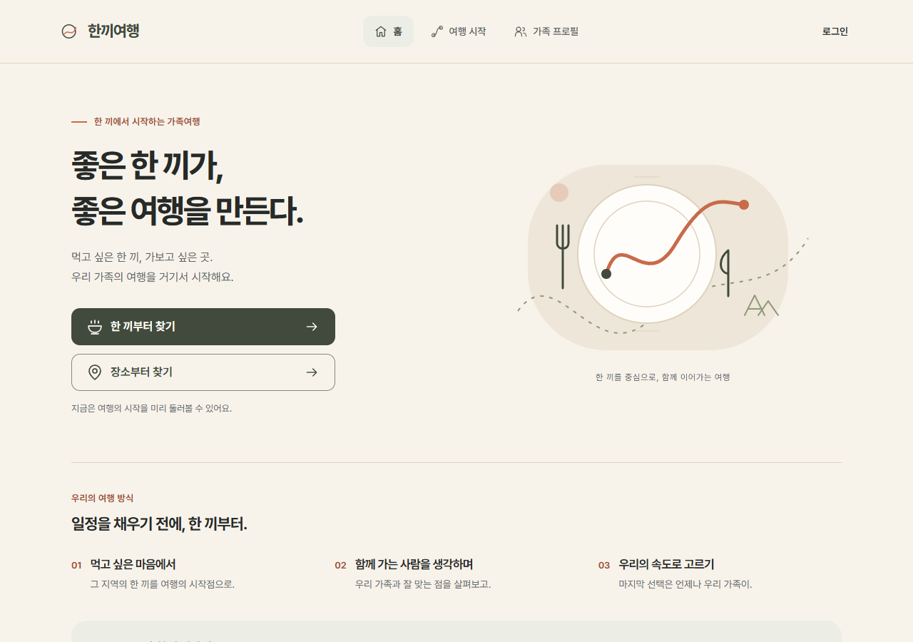
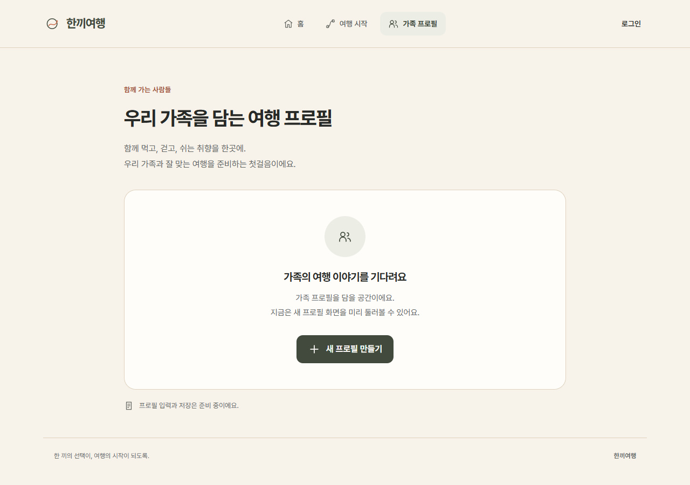
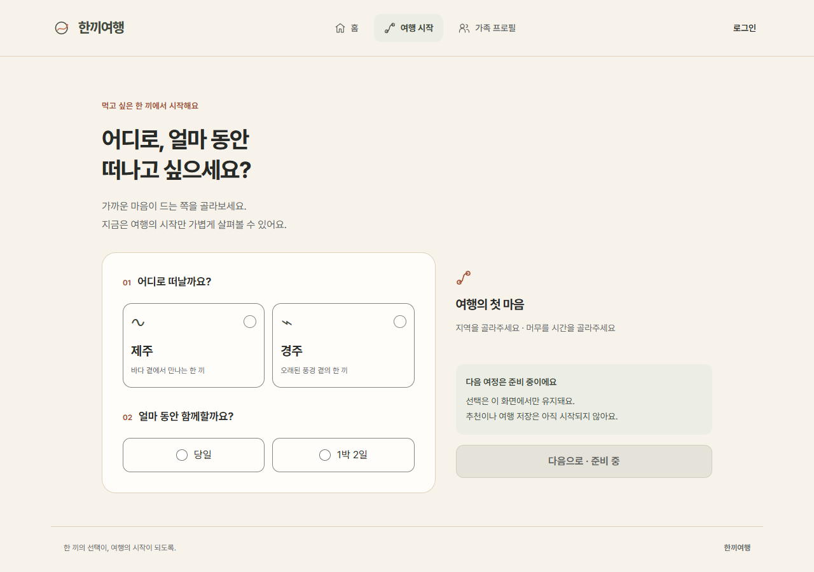
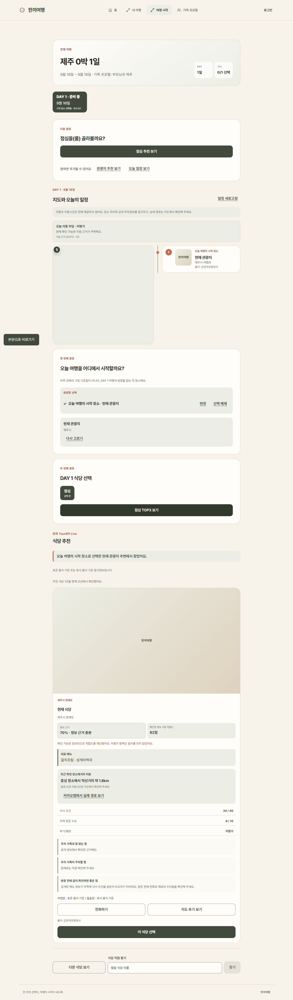
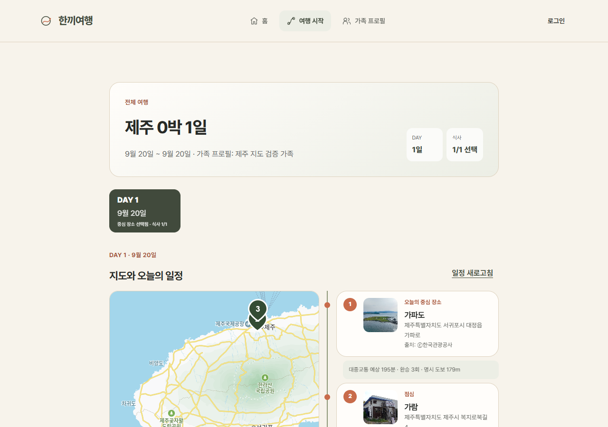
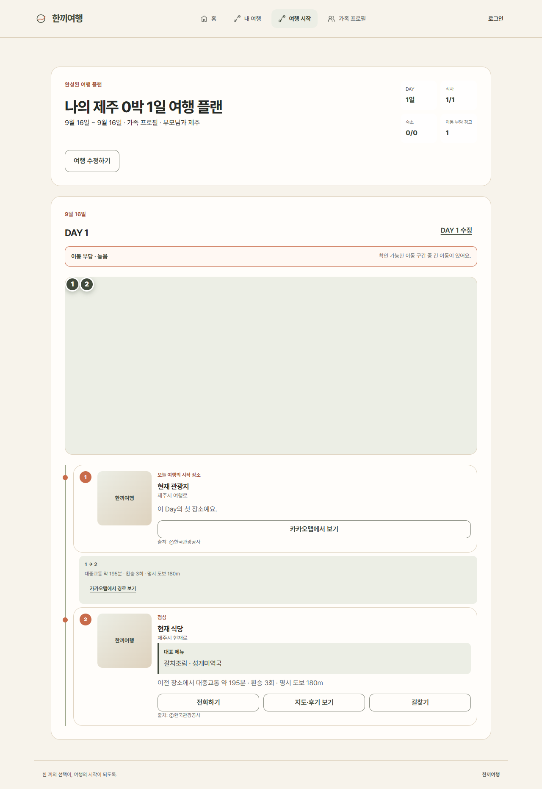

# 한끼여행 (HankkiTravel)

> 관광데이터를 바탕으로 가족의 식사 조건과 이동 부담을 함께 고려하는 여행·식당 플래너

[서비스 데모](https://hankki.kro.kr/) · [아키텍처](docs/architecture/README.md) · [API](docs/api/README.md) · [운영 구조](docs/infra/README.md) · [Troubleshooting](docs/troubleshooting/TROUBLESHOOTING.md)

## 한눈에 보기

| 항목 | 내용 |
| --- | --- |
| 서비스 | 가족 조건을 반영한 식당 추천 + 관광 일정 Planner |
| 현재 지역 | 제주시·서귀포시·경주시 |
| 데이터 경계 | TourAPI Live First, Nutrition reference 결합, 관광 원본·추천 결과는 runtime 처리 |
| Backend | Java 21, Spring Boot, MyBatis, Flyway, MySQL |
| Frontend | Vue 3, Vite, Pinia, Kakao Map |
| 운영 | Frontend Vercel / Backend AWS EC2, GitHub Actions → GHCR SHA → AWS SSM |

## 해결하려는 문제

가족 여행에서 식사는 단순한 맛집 검색 문제가 아닙니다. 동행인의 식사 주의사항, 이동 방식과 보행 부담, 식사 시간, 현재 일정이 같이 맞아야 실제로 선택 가능한 장소가 됩니다.

한끼여행은 가족 프로필과 여행 일정을 기준으로 음식점·관광지 후보를 조회하고, 추천 근거와 이동 부담을 함께 보여준 뒤 사용자가 선택한 장소를 날짜별 플랜으로 이어줍니다.

## 대표 화면



한 끼 또는 장소에서 여행을 시작하고, 가족 프로필과 일정 문맥을 이후 추천의 기준으로 사용합니다.

## 현재 서비스 구조

```text
가족 프로필 / 여행 일정
        ↓
Vue 3 / Vite / Pinia ── Kakao Map
        ↓ REST
Spring Boot Backend
   ├── TourAPI Live 조회
   ├── Nutrition reference matching
   ├── Kakao Local / Route
   ├── 추천·일정·이동 부담 계산
   └── MySQL
       └─ Guest / Profile / Trip / 선택한 provider reference

Frontend: Vercel
Backend : GitHub Actions → GHCR SHA image → AWS SSM → EC2 Docker Compose
```

TourAPI 목록·상세는 요청 시점에 조회하고 `no-store`로 응답합니다. KTO raw payload, 추천 후보·점수, route 결과를 현재 사용자 정보처럼 DB에 복제하지 않고, 사용자가 확정한 장소는 최소 provider reference를 저장해 다시 열 때 현재 상세정보를 조회합니다.

초기 Cache First / Sync 구현은 코드에 남아 있지만 현재 Production 사용자 추천·Planner의 데이터 기준이 아니며 `ADMIN_SYNC_ENABLED=false`가 기본값입니다.

## 핵심 구현과 기술 판단

- **Live First 전환** — 관광 원본 영속 정책 변화에 맞춰 사용자 상태와 외부 관광 원본을 분리하고 runtime hydration으로 전환했습니다.
- **Route-aware 추천** — 대상 Slot 직전 Anchor를 기준으로 가까운 코스와 대표 명소 코스를 나누고, shortlist 이후 제한된 후보에만 이동 API를 호출합니다.
- **외부 장소 매칭** — KTO와 Kakao 사이에 공통 장소 ID가 없어 이름·주소·좌표·category를 함께 검사하고 모호하면 연결하지 않습니다.
- **부분 장애 격리** — 일부 TourAPI 호출이 실패해도 정상 Live 결과는 유지하고, 실패한 근거를 0점이나 가짜 값으로 바꾸지 않습니다.
- **Production parity 검증** — Mock fixture의 optional field 조합과 Service Worker stale bundle을 실제 운영 흐름과 별도로 확인했습니다.
- **DB lifecycle 분리** — 신규 운영 DB bootstrap에서는 `migrate → validate → info` 순서로 Flyway workflow를 분리했습니다.

## 기술 스택

| 영역 | 구성 |
| --- | --- |
| Frontend | Vue 3, Vite, Pinia, Vue Router, Vitest, Playwright |
| Backend | Java 21, Spring Boot, Spring Security, MyBatis, Flyway |
| 데이터 | MySQL, 한국관광공사 TourAPI, 식품영양 reference |
| 지도·교통 | Kakao Map, Kakao Local / 이동 경로 연동 |
| 배포·운영 | Vercel, AWS EC2, GitHub Actions, GHCR, AWS SSM, Prometheus, Grafana |

## Troubleshooting

운영 중 직접 확인한 장애와 추천 품질 문제, 구조를 바꾸게 된 설계 결정은 [전체 Troubleshooting 문서](docs/troubleshooting/TROUBLESHOOTING.md)에 정리했습니다.

| 사례 | 확인한 핵심 |
| --- | --- |
| 502/CORS처럼 보인 Backend Restart | 배포 시각과 Proxy/Backend 상태를 대조해 브라우저 CORS 메시지와 실제 502 원인을 분리 |
| 18.9km 관광지 추천 | 최신 Anchor 문맥과 제한된 route 검증으로 현재 동선과 맞지 않는 1순위 수정 |
| Mock ↔ Production / PWA | optional field 조합과 오래된 Service Worker client를 Mock 성공과 별도로 검증 |
| Flyway 빈 DB bootstrap | 신규 운영 DB에서 migrate 이후 validate하도록 workflow 분리 |
| KTO ↔ Kakao strict matching | 다른 지점의 전화·장소 URL이 붙지 않도록 이름·주소·좌표·category를 함께 검사 |

TourAPI 부분 장애, GHCR → SSM 배포, SSH Tunnel/MySQL 인증은 짧은 장애 기록으로 남겼고, Cache First → Live First와 Front/Back 저장소 분리는 관련 설계 결정으로 구분했습니다.

## 주요 화면

모든 캡처는 테스트용 여행·장소 데이터로 구성했으며 실제 사용자 정보와 운영 비밀값은 포함하지 않습니다.

<details>
<summary><strong>가족 프로필</strong> — 함께 떠나는 사람의 식사·이동 조건 저장</summary>

이동 방식, 보행 부담, 식사 참고사항을 저장하고 이후 여행 생성에 사용합니다.


</details>

<details>
<summary><strong>여행 시작</strong> — 지역과 기간 선택</summary>

제주·경주와 여행 기간을 선택해 이후 추천과 일정 구성의 기준을 만듭니다.


</details>

<details>
<summary><strong>식당 추천</strong> — 가족 조건과 이동 부담을 함께 비교</summary>

현재 위치와 가족 조건을 바탕으로 후보와 추천 근거를 비교합니다.


</details>

<details>
<summary><strong>지도 일정 Planner</strong> — 일자별 방문 순서와 이동 정보</summary>

Kakao Map과 방문 순서를 함께 보며 선택한 장소와 이동 구간을 검토합니다.


</details>

<details>
<summary><strong>완성 플랜</strong> — 선택 결과와 다음 행동 확인</summary>

관광지·식당과 이동 구간을 정리하고 장소 상세·길찾기로 이어집니다.


</details>

## 저장소 구성

```text
HankkiTravel/
├── frontend/             # Vue/Vite 사용자 애플리케이션
├── backend/              # Spring Boot API / 추천·Planner / TourAPI Live 연동
├── docs/
│   ├── architecture/     # 현재 시스템·데이터 경계
│   ├── api/              # Live API 및 비활성 Sync 경계
│   ├── infra/            # AWS/Vercel 배포·관측 구조
│   ├── screenshots/      # 공개 서비스 캡처
│   └── troubleshooting/  # 장애·설계 결정 기록
└── .env.example          # 값 없는 환경 변수 템플릿
```

이 저장소는 공개 가능한 Frontend/Backend 코드와 문서를 한곳에서 검토할 수 있도록 구성한 통합본입니다. 실제 Production의 Vercel/AWS 연결과 운영 Secret은 저장소 밖에서 관리합니다.
