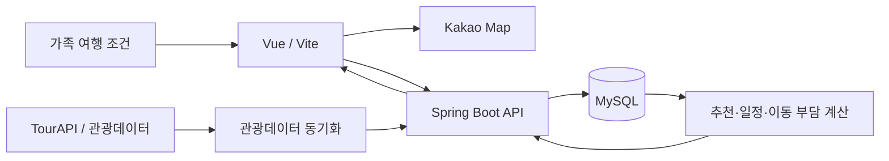

# 아키텍처

## 데이터와 추천 흐름



## 책임 경계

| 영역 | 주요 책임 |
| --- | --- |
| `frontend/` | 가족 프로필·여행 일정 입력, 추천 근거 표시, 지도 시각화, 접근성 있는 사용자 흐름 |
| `backend/tourism` | TourAPI 스냅샷 수집, 페이지 검증, 이상 스냅샷 방어, 관광 캐시 소유 |
| `backend/restaurant` | 음식점 특화 정보와 식사 조건에 맞는 후보 판단 |
| `backend/trip` | 여행·일정 상태와 추천 결과를 연결 |
| `backend/shared` | 좌표·외부 HTTP·오류 경계 등 공통 기술 책임 |
| MySQL | 관광 캐시, 가족 프로필, 음식점 특화 데이터, 여행 일정의 영속화 |

## 관광데이터 동기화 안전성

동기화는 외부 호출 결과가 완결성 검증을 통과한 뒤에만 Scope 단위 데이터 반영을 시작합니다.

```text
원격 페이지 수집
→ 전체 스냅샷 검증
→ 비정상 감소 감지
→ 정규화
→ Scope 단위 DB 트랜잭션
```

이 순서는 네트워크 오류나 부분 응답이 기존 관광 캐시를 비활성화하는 것을 막기 위한 경계입니다. 관리자 동기화는 기본적으로 비활성화되어 있으며, 운영에서는 단일 실행·일일 호출 예산·이상 스냅샷 방어를 적용합니다.
