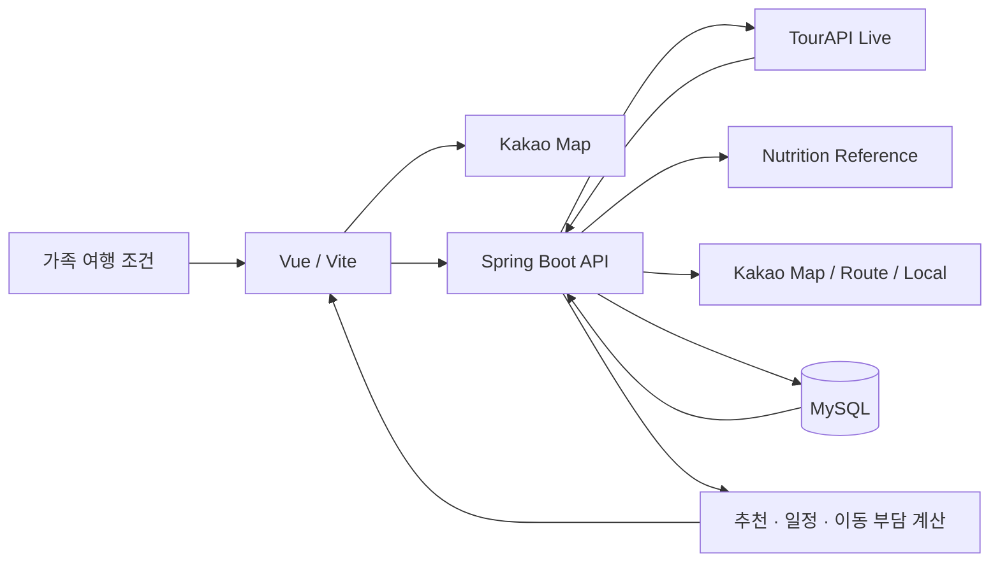

# 아키텍처

## 현재 사용자 경로

한끼여행의 현재 Production 사용자 경로는 **TourAPI Live First**를 기준으로 합니다.


```mermaid
flowchart LR
    U[가족 여행 조건] --> FE[Vue / Vite]
    FE --> MAP[Kakao Map]
    FE --> API[Spring Boot API]

    API --> TOUR[TourAPI Live]
    TOUR --> API

    API --> NUT[Nutrition Reference]
    API --> KAKAO[Kakao Map / Route / Local]

    API --> DB[(MySQL)]
    DB --> API

    API --> REC[추천 · 일정 · 이동 부담 계산]
    REC --> FE
```

TourAPI의 목록·상세 응답은 요청 시점에 조회하고 메모리에서 정규화합니다. 사용자 경로에서 관광 원본 캐시를 현재 정보의 기준으로 사용하지 않습니다.

선택한 장소를 다시 표시할 때도 저장된 최소 provider reference를 기준으로 현재 상세정보를 다시 조회합니다.

## 영속 데이터 경계

현재 사용자 기능에서 MySQL에 저장하는 데이터와 런타임에서만 다루는 데이터를 구분합니다.

| 구분 | 데이터 |
| --- | --- |
| 영속 | Guest/User, Family Profile, Trip, Day, Meal Slot, 사용자가 확정한 장소의 최소 provider reference, Nutrition reference |
| 런타임 | TourAPI raw/detail 응답, 추천 후보·점수, route 결과, 외부 장소 보강 결과 |
| 비활성 과거 구조 | Tourism cache / Sync/Admin 관련 구현 |

Live TourAPI 응답은 `Cache-Control: no-store`로 반환합니다. 추천·Planner 경로에서 KTO 원본 payload나 route 결과를 새 사용자 상태처럼 영속하지 않습니다.

## 책임 경계

| 영역 | 주요 책임 |
| --- | --- |
| `frontend/` | 가족 프로필·여행 일정 입력, 추천 근거 표시, 지도 시각화, 사용자 선택 흐름 |
| `backend/tourism` | TourAPI Live 조회·정규화, 상세정보 조회, 외부 응답 실패 경계 |
| `backend/recommendation` | 식당 후보 평가, Nutrition reference 결합, Kakao Local 보강 |
| `backend/trip` | Trip/Day 상태, 장소 선택 reference, Planner와 이동 부담 계산 |
| `backend/transit` | Kakao 이동 근거 조회와 실패 상태 구분 |
| MySQL | 사용자·여행 상태와 선택 reference, Nutrition reference 영속 |

## 과거 Cache First / Sync 구현

초기에는 관광 원본을 로컬 DB에 적재하는 Cache First + Periodic Sync 구조를 구현했습니다.

이후 데이터 이용 조건이 바뀌면서 Production 사용자 경로를 Live First로 전환했습니다. 기존 Sync/Admin 코드는 삭제하지 않고 Historical/Inactive 경로로 남겨 두었고 기본 설정도 `ADMIN_SYNC_ENABLED=false`입니다.

따라서 아래 구현은 현재 사용자 추천·Planner의 정본이 아닙니다.

- `TourismAdminSyncController`
- `TourismSyncService`
- `TourismCacheMapper`
- 기존 tourism cache table

관련 전환 과정은 [Troubleshooting 문서](../troubleshooting/TROUBLESHOOTING.md)의 `관광 데이터 Cache First에서 Live First로 전환` 항목에 정리했습니다.

## 배포 경계

현재 Backend Production은 AWS EC2의 Docker Compose에서 실행합니다.

```text
main push
→ GitHub Actions verify
→ GHCR SHA image
→ AWS OIDC
→ SSM deploy
→ EC2 Docker Compose backend 교체
→ /actuator/health 확인
```

Frontend는 Vercel에 배포합니다.

Backend workflow는 과거 Kubernetes/GitOps 이력과의 추적을 위해 private GitOps repository의 image tag도 갱신하지만, 현재 Production Backend runtime은 Kubernetes/Argo CD가 아니라 AWS EC2 경로입니다.

자세한 운영 구조는 [배포·운영 문서](../infra/README.md)를 참고하세요.
